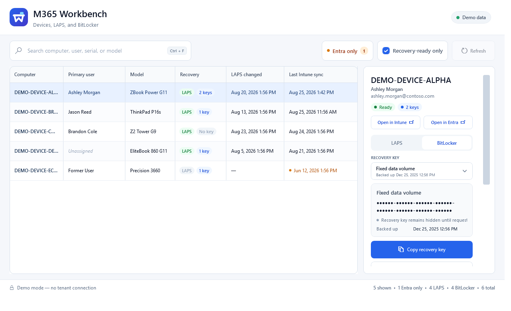

# M365 Workbench


[](https://github.com/tomkimberlin/m365-workbench/actions/workflows/tests.yml)
[](LICENSE)

M365 Workbench is a Windows desktop utility for Microsoft Entra ID and Microsoft Intune support work. The current release provides a searchable Windows device inventory with on-demand Windows LAPS and BitLocker recovery.



> **Status:** Early release. Device inventory and recovery are functional and covered by offline tests. The app currently performs Microsoft Graph reads only; device actions and other modules remain roadmap items.

## What it does

- Searches Windows devices by name, user, UPN, serial number, model, or Entra device ID.
- Combines Intune managed-device data with Entra device, Windows LAPS, and BitLocker metadata.
- Identifies Entra-only records without assuming they are stale or safe to delete.
- Shows device, management, compliance, encryption, sync, and approximate Entra activity details.
- Opens the selected device directly in the Intune or Entra admin center.
- Retrieves one selected LAPS password or BitLocker recovery key only after an explicit copy or reveal action.
- Excludes copied secrets from Windows Clipboard History and Cloud Clipboard and clears them after a configurable interval.

All screenshots, tests, and demo records use fictional `contoso` identities and explicit `DEMO-DEVICE-*` identifiers.

## Requirements

- Windows 10 or Windows 11
- PowerShell 7.4 or later
- `Microsoft.Graph.Authentication` 2.38.0 or later
- A Microsoft Entra work or school account in the configured tenant

## Quick start

Clone the repository and install the Graph authentication module:

```powershell
git clone https://github.com/tomkimberlin/m365-workbench.git
Set-Location .\m365-workbench
Install-Module Microsoft.Graph.Authentication -Scope CurrentUser
```

Create the ignored local settings file:

```powershell
Copy-Item .\M365Workbench.settings.example.psd1 .\M365Workbench.settings.psd1
```

Replace the fictional tenant domain, tenant object ID, and expected administrator UPN in `M365Workbench.settings.psd1`, then launch:

```powershell
.\Launch-M365Workbench.cmd
```

To install a desktop shortcut with the application icon and no console flash:

```powershell
pwsh.exe -NoLogo -NoProfile -File .\Install-DesktopShortcut.ps1
```

The app reuses Microsoft Graph's secure `CurrentUser` token cache when a valid delegated context already exists. If sign-in is required, it displays a device code and opens Microsoft's sign-in page in the default browser.

## Try it without a tenant

Demo mode is entirely local. It does not load a settings file, authenticate, or call Microsoft Graph.

```powershell
pwsh.exe -NoLogo -NoProfile -STA -File .\M365Workbench.ps1 -DemoMode
```

## Microsoft Graph permissions

The current workspace requests these delegated scopes together:

| Scope | Purpose |
| --- | --- |
| `Device.Read.All` | Entra device information |
| `DeviceManagementManagedDevices.Read.All` | Intune managed-device inventory |
| `DeviceLocalCredential.Read.All` | Windows LAPS metadata and selected password retrieval |
| `BitlockerKey.ReadBasic.All` | BitLocker recovery-key metadata |
| `BitlockerKey.Read.All` | Selected BitLocker recovery-key retrieval |

Administrator consent may be required. The signed-in operator must also have directory roles or custom-role actions that authorize the requested recovery data. Review Microsoft's current documentation before deployment:

- [Get deviceLocalCredentialInfo](https://learn.microsoft.com/graph/api/devicelocalcredentialinfo-get?view=graph-rest-1.0)
- [Use Windows LAPS with Microsoft Entra ID](https://learn.microsoft.com/entra/identity/devices/howto-manage-local-admin-passwords)
- [List Intune managed devices](https://learn.microsoft.com/graph/api/intune-devices-manageddevice-list?view=graph-rest-1.0)
- [List BitLocker recovery keys](https://learn.microsoft.com/graph/api/bitlocker-list-recoverykeys?view=graph-rest-1.0)
- [Get a BitLocker recovery key](https://learn.microsoft.com/graph/api/bitlockerrecoverykey-get?view=graph-rest-1.0)

## Security design

M365 Workbench handles privileged recovery material, so its recovery flow is deliberately narrow:

- Authentication is delegated and interactive; the project includes no unattended privileged identity or credential.
- Tenant-specific settings are local and ignored by Git.
- Inventory refreshes request metadata only, never LAPS passwords or BitLocker key values.
- A secret is fetched only for the selected device and only after **Copy** or **Reveal briefly**.
- Secrets are not intentionally written to files, logs, or PowerShell history.
- Revealed secrets hide automatically, and copied secrets are cleared only if the clipboard still contains the value written by this app.
- Intune and recovery records are joined by Entra device ID, not mutable device name.
- There is no bulk secret export path.

See [SECURITY.md](SECURITY.md) to report a vulnerability. Never put production tenant data, device names, screenshots, secrets, or logs in a public issue.

## Keyboard shortcuts

- `Ctrl + F` focuses device search.
- `Ctrl + Shift + C` copies the secret from the active LAPS or BitLocker tab.
- `F5` refreshes inventory.
- `Esc` immediately hides a revealed secret.

## Tests

The offline suite parses the PowerShell and WPF markup and validates data joining, authentication-context enforcement, secret decoding, portal-link validation, metadata-only inventory, clipboard protection, the no-console launcher, and key UI regressions. It does not connect to Microsoft Graph.

```powershell
pwsh.exe -NoLogo -NoProfile -File .\Tests\Test-M365Workbench.ps1
```

## Project scope

Entra ID spans identity, access, applications, roles, and device identities. Intune focuses on endpoint and application management. M365 Workbench is intended to grow into focused modules for common support workflows, not reproduce every Microsoft portal or replace Azure Arc, Defender, Configuration Manager, or full server-management tooling.

See [ROADMAP.md](ROADMAP.md) for planned work and [CONTRIBUTING.md](CONTRIBUTING.md) before submitting a change.

M365 Workbench is licensed under the [MIT License](LICENSE). It is not affiliated with or endorsed by Microsoft.
